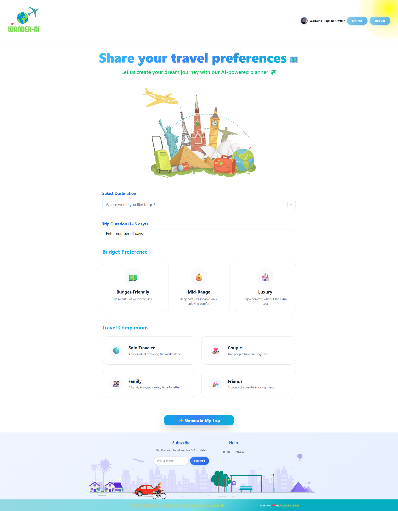
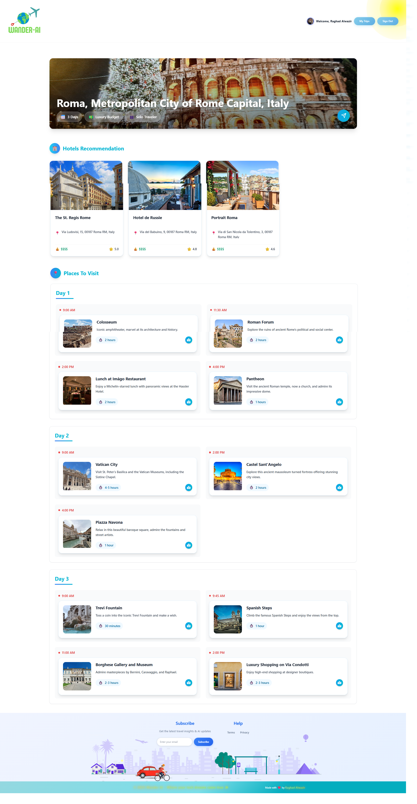
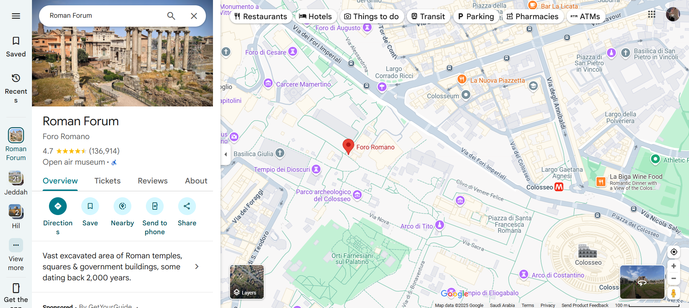

# WanderAI - AI Travel Planner

An intelligent web application that generates personalized travel itineraries using Google Gemini AI.

**Author:** Raghad Alwazir  
**University:** University of Greater Manchester - Bolton  
**Project:** Final Year Graduation Project

## Features

- 🤖 AI-powered travel planning with Google Gemini
- 🗺️ Google Places integration for real locations
- 🔐 Firebase authentication (Google OAuth + Email/Password)
- 💾 Save and manage multiple trips
- 🎯 Customizable budget and traveler preferences

## Tech Stack

- **Frontend:** React 18, Vite, Tailwind CSS
- **Backend:** Firebase (Firestore, Auth)
- **AI:** Google Gemini API
- **APIs:** Google Places, Google Maps
- **UI:** ShadCN UI Components

## Getting Started

### Prerequisites
- Node.js 16+
- npm or yarn
- Google Cloud account
- Firebase project

### Installation

1. Clone the repository
```bash
git clone <your-repo-url>
cd wander-ai
```

2. Install dependencies
```bash
npm install
```

3. Environment setup
```bash
# .env file is already included with API keys configured
# No additional setup required for API keys
```

4. Run the development server
```bash
npm run dev
```

5. Open [http://localhost:5173](http://localhost:5173)

## Project Structure

```
src/
├── components/          # UI components
├── create-trip/         # Trip creation pages
├── view-trip/           # Trip viewing pages
├── my-trips/            # User trips management
├── service/             # API services
│   ├── AIModal.js       # Google Gemini integration
│   ├── firebaseConfig.js# Firebase setup
│   └── GlobalApi.js     # Google Places API
└── constants/           # Static data
```

## How It Works

1. **User Input:** Select destination, days, budget, and traveler type
2. **AI Processing:** Google Gemini generates personalized itinerary
3. **Data Storage:** Trip saved to Firebase Firestore
4. **Image Integration:** Google Places API provides real location images
5. **Maps Integration:** Direct links to Google Maps for navigation

## Contributing

This is an academic project. For questions or collaboration:
- Email: [Alwazirraghad@gmail.com]

## Acknowledgments

- University of Greater Manchester - Bolton
- Google Cloud Platform for AI services
- Firebase for backend infrastructure
- React community for excellent tools

## 📸 Screenshots






